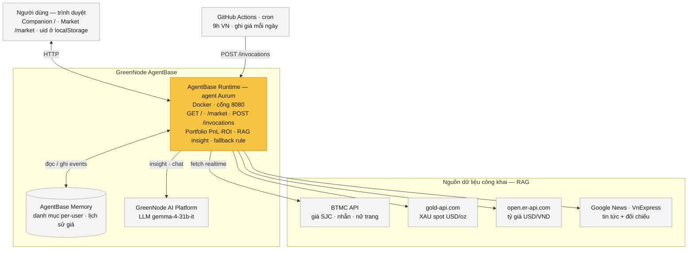

# 🪙 Gold Companion — Trợ lý AI Aurum

> **Biết vàng của bạn đang lời hay lỗ — mỗi ngày.**
> Personal Gold Wealth Companion trên nền tảng GreenNode AgentBase.

**Track dự thi:** Agentic Assistant
**Live demo:** https://endpoint-e4155b14-9988-458d-8c2f-45fb9d795062.agentbase-runtime.aiplatform.vngcloud.vn/

---

## 1. Vấn đề (Problem)

Người Việt giữ vàng rất nhiều như một kênh tích sản, nhưng hầu hết **chỉ biết "giá vàng hôm nay"** — chứ không biết **danh mục của riêng mình đang lời hay lỗ bao nhiêu**.

Thực tế đau hơn: mỗi lần mua thường khác nhau — khác **loại** (vàng miếng SJC, nhẫn tròn trơn, nữ trang…), có khi khác **thương hiệu** (SJC, PNJ, DOJI…), khác **mức giá** và khác **thời điểm**. Người dùng — đặc biệt là **người lớn tích sản lâu năm** — phải **tính tay** từng lệnh để biết tổng tài sản và lời/lỗ, rất cực và dễ sai. Họ thực sự quan tâm **biến động thị trường ảnh hưởng thế nào tới đúng những tài sản mình đang sở hữu**, chứ không phải giá chung chung. Các app/website hiện tại chỉ hiển thị giá thị trường, thiếu góc nhìn cá nhân hóa và thiếu một "người đồng hành".

## 2. Người dùng (User)

Cá nhân tích sản vàng (vàng miếng SJC, nhẫn tròn trơn, nữ trang…) — gồm cả **người lớn tuổi đang phải tính tay nhiều lệnh mua khác thương hiệu/giá/thời điểm** — muốn:
- Tự động **gộp mọi lệnh mua** và biết **tổng tài sản đang lời/lỗ bao nhiêu**, ROI ra sao (thay cho việc tính tay).
- Hiểu **biến động thị trường tác động tới chính tài sản mình đang giữ**.
- Nhận **tư vấn ngắn gọn, trấn an** dựa trên danh mục + tin tức thật.
- Ra quyết định và (tầm nhìn) thanh toán mua/bán ngay trong một luồng.

## 3. Giải pháp (Solution)

**Aurum** — trợ lý AI đóng vai nhà phân tích tài chính cá nhân, tự động:

1. **Theo dõi danh mục cá nhân** — user nhập các lệnh mua vàng (loại, số lượng, giá mua); hệ thống tự tính **giá trị hiện tại · PnL · ROI · tổng tài sản**, lưu bền vững theo tên qua AgentBase Memory.
2. **Tổng hợp dữ liệu thật realtime (RAG)** — giá SJC/nhẫn (BTMC), vàng thế giới (gold-api) + tỷ giá USD/VND quy đổi, và **tin tức đa nguồn** (VnExpress, VietNamNet, Lao Động… qua Google News RSS).
3. **Tư vấn cá nhân hóa & actionable** — Aurum đối chiếu vị thế danh mục với tin tức, đưa nhận định **2-3 câu, trấn an**, nêu điểm sáng/điểm cần lưu ý, neo giá mua trung bình, gợi ý 1 hành động phù hợp (tối ưu giá vốn / tích sản).
4. **Đóng vòng giao dịch (tầm nhìn sản phẩm)** — nút hành động → popup thanh toán **Zalopay (giả lập)**, mua/bán cập nhật thẳng vào danh mục.

→ Luồng: **Đọc tin → Nhận tư vấn từ Aurum → Ra quyết định → Thanh toán.**

> **Phạm vi demo & roadmap:** bản dự thi dùng nguồn giá công khai **BTMC**, hỗ trợ **vàng miếng SJC · nhẫn tròn trơn · nữ trang**. Mở rộng **đa thương hiệu (PNJ, DOJI…)** và thêm nguồn giá là hướng phát triển tiếp theo.

---

## Tính năng chính

- 🔐 Màn chào nhập tên (lưu danh mục riêng theo tên qua các lần truy cập)
- 💰 Hero dashboard: tổng tài sản, **tổng lời/lỗ (PnL) nổi bật**, ROI
- 🤖 Aurum insight cá nhân hóa + chat hỏi đáp (RAG tin tức + giá realtime)
- ⚡ Action Card thông minh theo trạng thái ROI danh mục
- 💳 Popup giao dịch Zalopay (giả lập) — tab Mua/Bán, cảnh báo bán vượt số lượng
- 📈 Trang `/market`: biểu đồ giá SJC vs quốc tế + đối chiếu nguồn VnExpress
- 📰 Tin tức tham khảo (accordion) kèm link bài gốc
- 🔄 Tự cập nhật & lưu lịch sử giá mỗi ngày (DoD)

## Kiến trúc & công nghệ



> **Luồng:** trình duyệt gọi `POST /invocations` → Runtime (Aurum) đọc/ghi danh mục & lịch sử giá ở Memory, fetch giá + tin realtime từ nguồn ngoài, gọi LLM tổng hợp nhận định; **GitHub Actions cron** 9h sáng tự ghi giá vào Memory mỗi ngày.

- **Nền tảng:** GreenNode AgentBase (Custom Agent runtime, Docker)
- **SDK:** `greennode-agentbase` (HTTP server, port 8080)
- **LLM:** `google/gemma-4-31b-it` qua GreenNode AI Platform (MaaS) — có fallback rule-based khi LLM lỗi · [benchmark chọn model →](docs/model-benchmark.md)
- **Lưu trữ:** AgentBase Memory (events) — danh mục per-user + lịch sử giá
- **Nguồn dữ liệu thật:** BTMC API (giá vàng VN), gold-api.com (XAU spot), open.er-api.com (USD/VND), Google News RSS + VnExpress (tin tức)
- **Endpoints:** `GET /` (companion app) · `GET /market` (biểu đồ) · `GET /data.json` (RAG JSON) · `POST /invocations` (API actions) · `GET /health`

## Tuân thủ (Compliance)

- ✅ Khai báo rõ người dùng **đang tương tác với AI** (Aurum).
- ✅ Chỉ dùng **dữ liệu công khai + số liệu demo synthetic**; **không thu thập PII/dữ liệu cá nhân thật**; có nút "Xóa danh mục".
- ✅ Nhận định mang tính **tham khảo, không phải lời khuyên đầu tư**; không cam kết lợi nhuận.
- ⚠️ Tính năng thanh toán Zalopay là **giả lập/định hướng sản phẩm**, không phát sinh giao dịch thật.
- ✅ Dùng model nền tảng (Gemma/Qwen của GreenNode), không dùng model ngoài.

## Chạy & deploy

```bash
# Local
pip install -r requirements.txt
python main.py          # http://127.0.0.1:8080

# Deploy lên AgentBase
/agentbase-deploy        # build → push → update runtime
```

---

*Gold Companion · Trợ lý AI Aurum · GreenNode AgentBase · Developed by Yuna*
